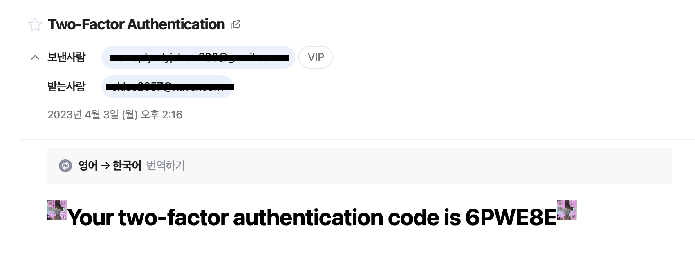
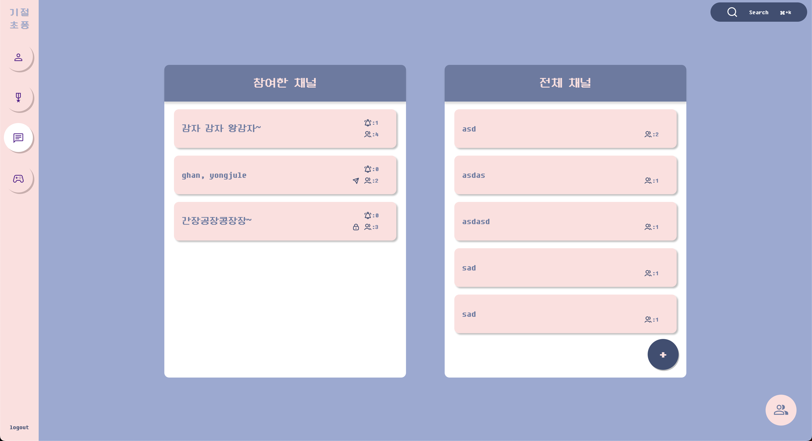
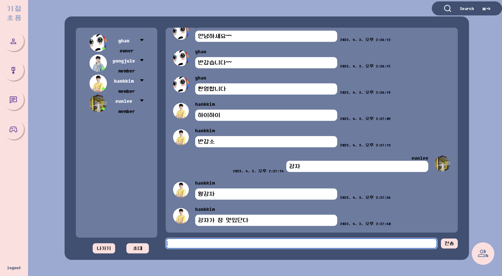
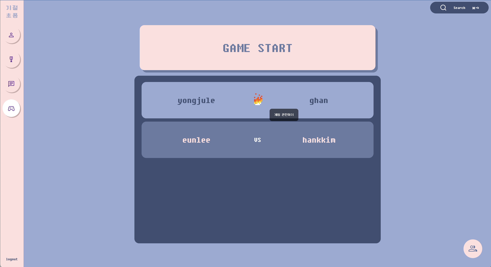
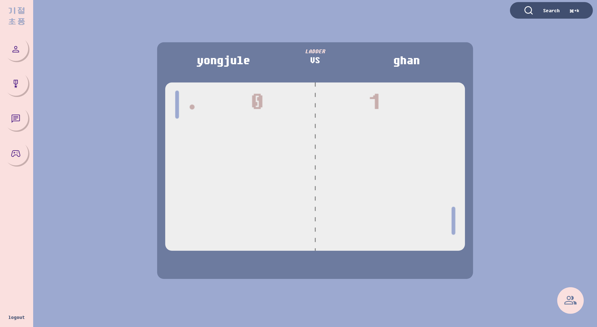
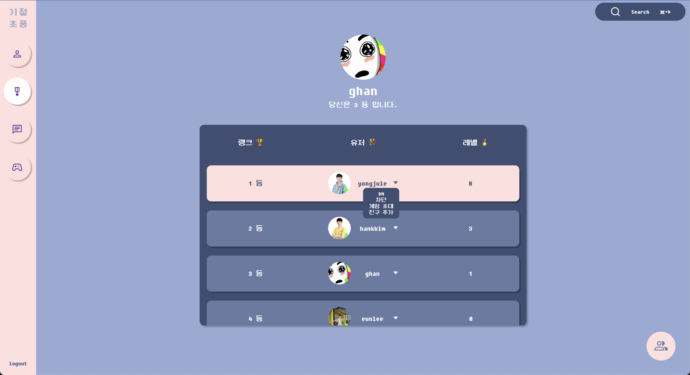
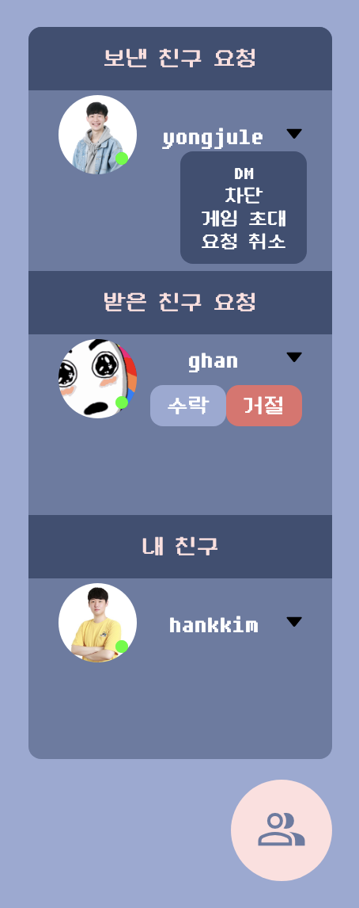
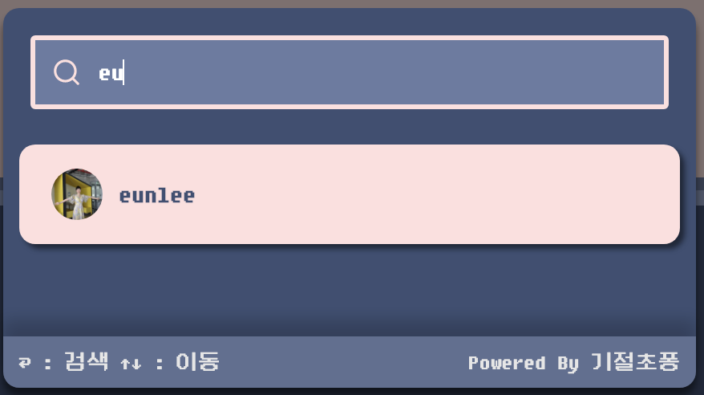

# 기절초퐁

<p align='center'>
<figure>
<p align="center">
  
</p>
</figure>
</p>

<figure>
<p align="center">
  
</p>
</figure>

<p align='center'>
  <b><em>친구와 함께하는 채팅과 멀티플레이 Pong 게임 서비스</em></b>
</p>

## 기술 스택

<p align='center'>


<br>


<br>


</p>

## 기간

2022.12 ~ 2023.03

## 설치 및 실행

```Shell
git clone https://github.com/brilliantshell/ft_transcendence.git
cd ft_transcendence
# .env.production.sample 파일 기반으로 .env.production 파일 생성
docker compose up --build
```

## 기능

### 🗝️ 로그인

- 42 API OAuth 로 일차 인증 후, access token & refresh token 발급하여 유저 인증
  - refresh token 의 재사용 감지 기능을 추가하여 보안 강화
- Nodemailer 를 활용하여 이메일 인증코드 2차 인증

### 🧒 유저 프로필

- 닉네임, 프로필 사진 수정 및 2차 인증 설정
- 유저 접속 상태(🟢 online / 🟠 in-game / 🔴 offline) 실시간 업데이트
- Pong 게임 레벨, 전적, 업적

### 🕹️ 멀티플레이 Pong 게임

- 실시간 관전 가능한 2D 반응형 1 vs 1 Pong 게임
- 네트워크 지연 및 재연결 시에도 게임 session 유지
- 다양한 게임 모드 지원 (공 사이즈 2x, 짧은 paddle)
- 플레이어 랭킹 보드

### 💬 채팅

- 실시간 메시지 전송 및 수신
- 유저 간 DM 기능
- 채팅 방 소유자(owner)
  - 채팅 방 모드 및 비밀번호 설정, 참여자에게 채널 권한을 부여하거나 삭제하는 등 모든 권한
- 채팅 방 관리자(admin)
  - 다른 유저를 채널에서 추방하거나 일정 시간 동안 음소거 할 수 있는 권한
- 유저를 검색하고 채팅 방에 초대
- 전체 채팅 방 리스트에서 생성 또는 삭제된 채팅방, 읽지 않은 메시지 개수, 접근 권한 변경 등을 실시간 반영

### 👯 유저 관계

- 친구 리스트에서 받거나 보낸 친구 요청과 내 친구들을 간편하게 확인
- 차단 시 일부 상호 작용 제한 (채팅 숨김, 친구 요청 금지, 게임 초대 금지, etc.)

## 서비스 UI

### 회원가입

<figure>
<p align="center">
  
</p>
</figure>

<figure>
<p align="center">
  
</p>
</figure>

### 채팅

<figure>
<p align="center">
  
</p>
</figure>

<figure>
<p align="center">
  
</p>
</figure>

### Pong 게임

<figure>
<p align="center">
  
</p>
</figure>

<figure>
<p align="center">
  
</p>
</figure>

<figure>
<p align="center">
  
</p>
</figure>

### 유저 프로필

<figure>
<p align="center">
  
</p>
</figure>

### 랭킹 보드

<figure>
<p align="center">
  
</p>
</figure>

### 친구 리스트

<figure>
<p align="center">
  
</p>
</figure>

### 검색창

<figure>
<p align="center">
  
</p>
</figure>
